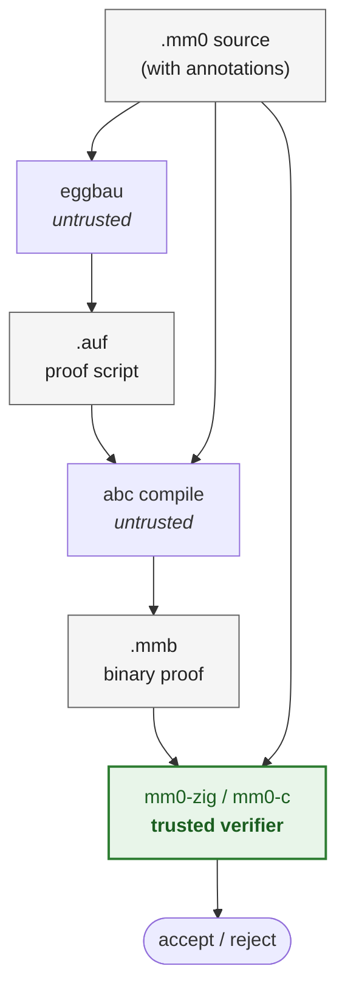

# eggbau

`eggbau` is a proof-search bridge from [egglog]'s equality saturation
engine into the [MM0] proof ecosystem, by way of the [Aufbau] proof compiler. 
Given an MM0 source file containing theorems annotated for
export, eggbau runs egglog as the search backend, translates the resulting
proof objects into ordinary Aufbau `.auf` proof scripts, and hands them
to the existing `abc` compiler and MM0 verifier.

[MM0]: https://github.com/digama0/mm0
[Aufbau]: https://github.com/gleachkr/Aufbau
[egglog]: https://github.com/egraphs-good/egglog

## How the pieces fit together

If you have not used MM0 before, the tools are small and split along a
sharp trust boundary:

- **MM0** is a minimal specification language. A `.mm0` file declares
  sorts, term constructors, axioms, and the *statements* of theorems —
  but not their proofs. Proofs live in a separate binary `.mmb` stream.
  A tiny verifier (`mm0-c` or `mm0-zig`) reads the `.mm0` spec and the
  `.mmb` proof and checks one against the other. The verifier is small, 
  simple, surveyable, and therefore trustworthy.
- **Aufbau** is an untrusted frontend on top of MM0. Its `.auf` proof
  script language is a human-writable proof format; the `abc` compiler
  takes `(file.mm0, file.auf)` and emits `file.mmb`. Anything `abc`
  produces still has to clear the MM0 verifier.
- **egglog** is an e-graph saturation language with first-class proof
  reconstruction: it can not only derive equalities and Horn-style
  conclusions, but also return a structured proof object explaining
  *how*.
- **eggbau** sits between them. It reads MM0 declarations and a small
  set of in-source annotations, picks the theorems that are allowed to
  be used as rewrite/Horn rules, generates an egglog program, runs the
  saturation, and translates each egglog proof justification
  (`Rule`, `Trans`, `Sym`, `Congr`, restricted `Fiat`) into the
  corresponding MM0/Aufbau steps.

The end-to-end pipeline:



Note that `.mm0` feeds three independent consumers: eggbau (to pick
exports and shape the goal), `abc` (during compilation), and the
verifier (as the spec the `.mmb` is checked against). eggbau is *not*
a verifier extension and is not part of the trusted MM0 kernel; it also
does not emit `.mmb` directly. The binary proof always comes from
`abc`, and the verifier always reads the original `.mm0`.

## Quick start

```sh
git submodule update --init --recursive
CARGO_HOME="$PWD/.cargo_home" cargo build --release
```

eggbau vendors a patched egglog under `vendor/egglog`; the patch exposes
a read-only proof API and is applied automatically by the
`vendor/egglog-eggbau` wrapper's `build.rs`. The submodule must be
initialized first — Cargo resolves the path dependency before the
wrapper's build script runs.

A worked example using the bundled fixture
`tests/fixtures/cli_e2e.mm0`:

```text
sort s;
provable sort wff;
term f (x: s): s;
term eq (x y: s): wff;
--| @relation s eq eq_refl eq_trans eq_sym _
axiom eq_refl (x: s): $ eq x x $;
axiom eq_trans (x y z: s): $ eq x y $ > $ eq y z $ > $ eq x z $;
axiom eq_sym (x y: s): $ eq x y $ > $ eq y x $;
--| @saturation ltr
axiom f_id (x: s): $ eq (f x) x $;

theorem target (x: s): $ eq (f x) x $;
```

`target` is the bodyless theorem we want a proof of; `f_id` is exported
as a left-to-right rewrite, `@relation` provides reflexivity, symmetry,
and transitivity. Run:

```sh
./target/release/eggbau prove tests/fixtures/cli_e2e.mm0 \
    --theorem target --out generated.auf
abc compile tests/fixtures/cli_e2e.mm0 generated.auf generated.mmb
mm0-zig generated.mmb < tests/fixtures/cli_e2e.mm0
```

If `mm0-zig` exits clean, the kernel has accepted eggbau's
reconstruction.

## Authoring: which theorems get exported

eggbau only exports theorems that explicitly opt in. Discovery commands
can *suggest* candidates, but they do not authorize export.

### `@saturation` — eggbau's own annotation

Assertion-level `@saturation` declares that a theorem may be used as a
rewrite or forward rule in the egglog search:

```text
--| @saturation ltr      -- export equality as left-to-right rewrite
--| @saturation rtl      -- right-to-left
--| @saturation both     -- both orientations
--| @saturation horn     -- export an implication as a forward rule
```

`ltr`/`rtl`/`both` apply to theorems whose conclusion is a declared
relation (typically equality on some sort). `horn` applies to theorems
of the shape *atomic premises ⇒ atomic conclusion*; eggbau exports them
as egglog forward rules and reconstructs uses through ordinary MM0 rule
application plus, where needed, congruence and transport.

### Reused Aufbau metadata: `@relation` and `@congr`

eggbau also consumes two pre-existing Aufbau annotations:

- `@relation SORT REL REFL TRANS SYM TRANSPORT` bundles the reflexivity,
  symmetry, transitivity, and (optional) transport theorems for a
  sort-level equivalence. eggbau uses this when reconstructing
  `Trans`/`Sym` justifications and when moving proofs across equal
  arguments via the relation's transport rule.
- `@congr` marks a theorem as a congruence law for a term constructor,
  including predicate constructors whose result sort is provable. This
  is what lets eggbau turn egglog's `Congr` justification into an
  explicit MM0 proof.

Predicate transport is intentionally not a separate annotation:
`@congr` on a predicate plus a `wff`-level relation's transport theorem
is enough to move a fact across equal arguments.

### Why not `@rewrite`?

Aufbau already uses `@rewrite` to feed its own deterministic
normalizer. A theorem that is useful for egglog saturation is not
necessarily appropriate for Aufbau's normalizer, and vice versa.
eggbau therefore treats the two namespaces as disjoint: a theorem
marked only with `@rewrite` is not exported, and `@saturation` is not
consumed by `abc`.

## CLI

```sh
eggbau --version
eggbau discover INPUT.mm0 [--suggest-annotations]
eggbau list INPUT.mm0
eggbau prove INPUT.mm0 [OPTIONS]
eggbau script emit INPUT.mm0 [OPTIONS]
eggbau script prove INPUT.mm0 [OPTIONS]
eggbau script check INPUT.mm0 [OPTIONS]
```

`prove` is the main command. It accepts one or more public theorem
targets and writes the generated `.auf` to stdout unless `--out` is
supplied:

```sh
eggbau prove tests/fixtures/cli_e2e.mm0 \
  --theorem target \
  --out generated.auf
```

Target and output options:

```text
-t, --theorem NAME       Prove a public theorem from INPUT.mm0
    --lemma HEADER       Prove and emit a proof-local Aufbau lemma
    --targets FILE       Read theorem/lemma targets, one per line
-o, --out FILE           Write generated .auf to FILE
    --base FILE          Splice generated proofs into an existing .auf
    --format FORMAT      Formatting dimension value: explicit, implicit,
                         compact, nocompact, kernel, or notation
```

`--format` may be supplied multiple times. `explicit`/`implicit`,
`compact`/`nocompact`, and `kernel`/`notation` are independent
dimensions; the last value in each dimension wins. `kernel` is the
default math renderer. `notation` asks the `.auf` renderer to use the
last printable MM0 notation declared for each constructor.

A target file is line-oriented:

```text
-- comments and blank lines are ignored
theorem target
lemma local_id (x: s): $ eq (f x) x $
```

`list` prints script-friendly public theorem targets in MM0 declaration
order:

```sh
eggbau list tests/fixtures/cli_multi.mm0
```

### Editable egglog scripts

The `script` subcommands expose the intermediate egglog program so it
can be inspected, hand-edited, and replayed:

```sh
eggbau script emit tests/fixtures/cli_e2e.mm0 \
  --theorem target > target.egg

eggbau script prove tests/fixtures/cli_e2e.mm0 \
  --theorem target \
  --script target.egg \
  --out generated.auf
```

`script check` runs an egglog script and validates the reconstructed
proof without rendering `.auf` — useful while debugging an edited
script.

## Library API

Rust callers can keep a parsed proof-search session in memory and prove
public or generated theorem obligations without shelling out to `abc`:

```rust
use eggbau::{EggbauSession, GoalSpec};

let mut session = EggbauSession::from_mm0(mm0_text)?;
let proof = session.prove_theorem("target")?;
let cert = session.prove_to_cert("target")?;
let auf = session.render_auf_for_theorem("target", &cert)?;

let generated = GoalSpec::generated_theorem(
    "downstream_target (x: s): $ eq (f x) x $",
);
let generated_proof = session.prove_goal(generated)?;
```

`ProofResult` contains the theorem name, rendered `.auf` block, optional
editable egglog program text, certificate IR, and diagnostics. The
stable API uses eggbau's own certificate types — egglog's `ProofStore`
and `ProofId` are not part of the public surface.

## End-to-end verification

A generated proof is checked by the ordinary Aufbau/MM0 pipeline:

```sh
eggbau prove tests/fixtures/cli_e2e.mm0 \
  --theorem target \
  --out generated.auf
abc compile tests/fixtures/cli_e2e.mm0 generated.auf generated.mmb
mm0-zig generated.mmb < tests/fixtures/cli_e2e.mm0
```

The end-to-end CLI tests look for `abc` and `mm0-zig` on `PATH`; you
can also point them at specific binaries:

```sh
EGGBAU_ABC=/path/to/abc \
EGGBAU_MM0_ZIG=/path/to/mm0-zig \
CARGO_HOME="$PWD/.cargo_home" cargo test --test cli_e2e
```

If neither is available, those tests print a skip message and return.

## Development

The vendored egglog dependency is patched to expose proof internals
that are not yet public upstream. After submodule init,
`vendor/egglog-eggbau/build.rs` applies the patch automatically before
compiling. If the submodule is not initialized at all, Cargo may fail
while resolving the path dependency before the wrapper build script
runs; initialize it with:

```sh
git submodule update --init --recursive
```

Useful validation commands:

```sh
CARGO_HOME="$PWD/.cargo_home" cargo fmt --all -- --check
CARGO_HOME="$PWD/.cargo_home" cargo build --all-targets --all-features
CARGO_HOME="$PWD/.cargo_home" cargo test --all-targets --all-features
CARGO_HOME="$PWD/.cargo_home" cargo clippy --all-targets --all-features -- \
  -D warnings
```
